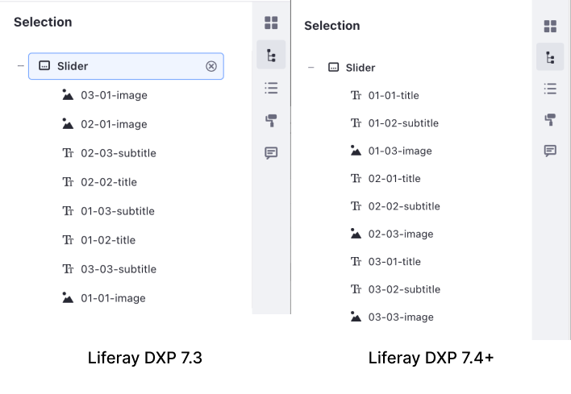
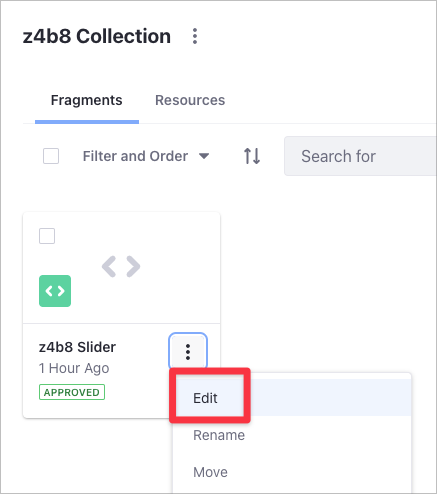
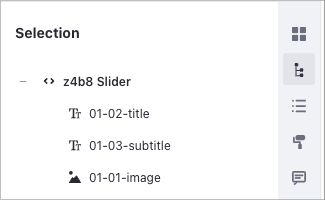

# Setting the Order of Elements in a Fragment

> Availability: Liferay 7.4+.

The [Slider](../../displaying-content/using-fragments/using-fragments.md#slider) or [Tab](../../displaying-content/using-fragments/using-fragments.md#tabs) fragments are typically used to show different areas of information. Sliders present this information in a carousel of slides. Tabs have multiple tabs, each one containing different information.

When you edit your Slider or Tab Fragment in the [Content Page Editor](../../creating-pages/building-and-managing-content-pages/editing-content-pages.md), the sidebar selection () button shows the list of elements in your Fragment. Before Liferay DXP 7.4, these elements were not presented in order. This made it difficult to identify how the Slider or Tab elements were grouped, especially for Fragments with many elements.



Starting with Liferay DXP 7.4, the Slider and Tab Fragments show their elements in order. Additionally, Liferay DXP 7.4 includes the new `data-lfr-priority` HTML attribute to set the order of elements in a Fragment. Elements with a lower `data-lfr-priority` value have precedence in the Selection list, independently of their order in the HTML code.

## Customizing the Order of Elements in the Slider Fragment

1. Go to *Site Administration* &rarr; *Design* &rarr; *Fragments*.

1. Under the *Collections* area, click the Collection with the Fragment you want to customize.

1. Click on the Slider or Tab Fragment's *Actions* () button and select *Edit* to open the [Fragments Editor](./using-the-fragments-editor.md).

    

1. In the HTML code area, you can Edit the Slider Fragment code. Add the `data-lfr-priority` attribute to the Editable or Drop Zone areas. This example configures the carousel elements to use this order:

   1. `First Slide Title`, with `data-lfr-priority="1"`
   1. `First Slide Subtitle`, with `data-lfr-prioriy="2"`
   1. `First Responsive Image`, with `data-lfr-priority="3"`

    ```html
        <div class="carousel-inner text-break" id="${fragmentEntryLinkNamespace}-carouselInner" role="group">
            <div class="carousel-item active">
                

                <div class="carousel-caption d-none d-md-block">
                    <h2
                        data-lfr-editable-id="01-02-title"
                        data-lfr-editable-type="rich-text"
                        data-lfr-priority="1"
                    >
                        First Slide Title
                    </h2>

                    <p
                        data-lfr-editable-id="01-03-subtitle"
                        data-lfr-editable-type="rich-text"
                        data-lfr-priority="2"
                    >
                        First Slide Subtitle
                    </p>
                </div>
            </div>
    ```

    This is the result you see in the Content Page Editor when you click the *Selection* ( button:

    

    ```note::
       You don't need to edit other parts of the Fragment's code, like JavaScript, CSS, or configuration.
    ```

## Verifying the New Order of Elements in the Content Page Editor

1. Go to *Site Administration* &rarr; *Site Builder* &rarr; *Pages*.

1. Edit the Content Page where you want to add the Slider Fragment sample (or [add a new Page](../../creating-pages/adding-pages/adding-a-page-to-a-site.md)).

1. From the Content Page sidebar, click *Fragments and Widgets* ().

1. Under the Fragments column, find the Slider or Tab Fragment you want to show.

1. Drag and drop the Fragment onto the editing area.

1. In the Content Page Sidebar, click the *Selection* () button to show the list of elements in your Fragment.

    ```note::
        Slider or Tab Fragments that you import from a version prior to Liferay DXP 7.4 appear in order in the Content Page Editor sidebar but don't include the `data-lfr-priority` HTML attribute. You must edit the HTML Fragment code to include this attribute.
    ```

## Related Information

- [Using the Fragments Toolkit](./using-the-fragments-toolkit.md)
- [Using the Fragments Editor](./using-the-fragments-editor.md)
- [Developing Fragments](./developing-fragments-intro.md)
