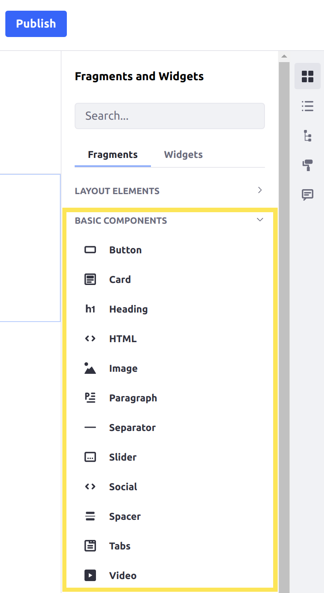

# Using Page Fragments

Page *Fragments* are extensible, reusable, drag-and-drop elements that serve as the primary building blocks for [Content Pages](../../creating-pages/building-and-managing-content-pages/content-pages-overview.md). Each Fragment is built using CSS, HTML, and JavaScript. Together, Fragments define your page's design and provide functionality along with widgets. You can [create your own Fragment](../../developer-guide/developing-page-fragments/developing-fragments-intro.md) or use a number of Fragments that are available out-of-the-box.

You may, however, require custom fragments. You can create your own Page Fragments using the built-in [Page Fragment editor](../../developer-guide/reference/fragments/page-fragment-editor-interface-reference.md) or locally from your desktop with the [Fragments Toolkit](../../developer-guide/developing-page-fragments/using-the-fragments-toolkit.md). For a deeper dive into creating a custom Page Fragment, see [Developing Page Fragments](../../developer-guide/developing-page-fragments/developing-fragments-intro.md).

You can [embed Liferay widgets](../../developer-guide/reference/fragments/fragment-specific-tags-reference.md#including-widgets-within-a-fragment) and add fields containing text and images into page fragments. End users can add content to these page elements during the final Content Page publication process.

Page Fragments are organized into Collections. Collections group related Fragments together so you can manage them easily. Fragments are accessible through these Collections when [building a Content Page](../../creating-pages/building-and-managing-content-pages/adding-elements-to-content-pages.md). You can include resources in Page Fragment Collections and reference them from your Page Fragment's code without worrying about their availability. This is helpful when moving Page Fragments. See [Including Default Resources in Page Fragments](../../developer-guide/developing-page-fragments/including-default-resources-with-fragments.md) for more information.

## Additional Information

- [Content Pages Overview](../../creating-pages/building-and-managing-content-pages/content-pages-overview.md)
- [Page Fragments User Interface Reference](../../creating-pages/building-and-managing-content-pages/page-fragments-user-interface-reference.md)
- [Developing Fragments](../../developer-guide/developing-page-fragments/developing-fragments-intro.md)
