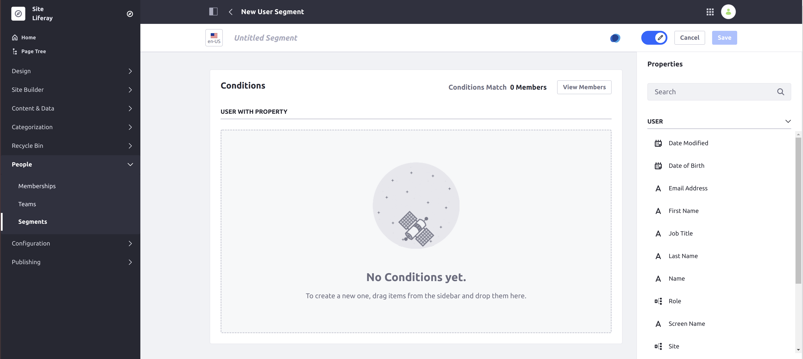
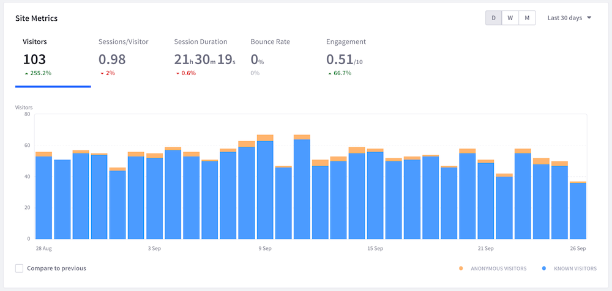
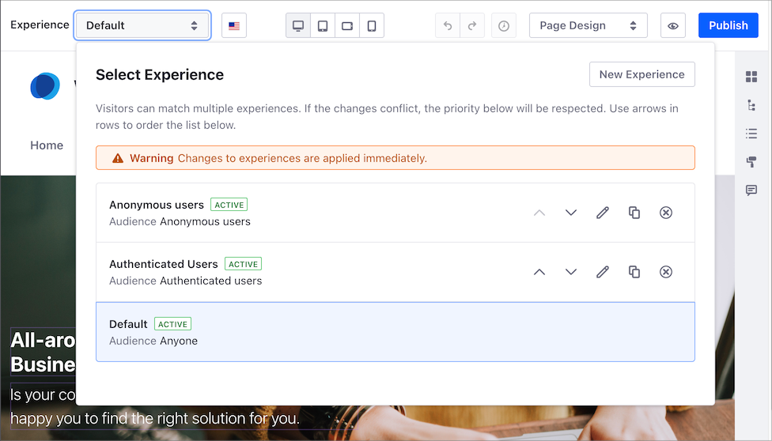
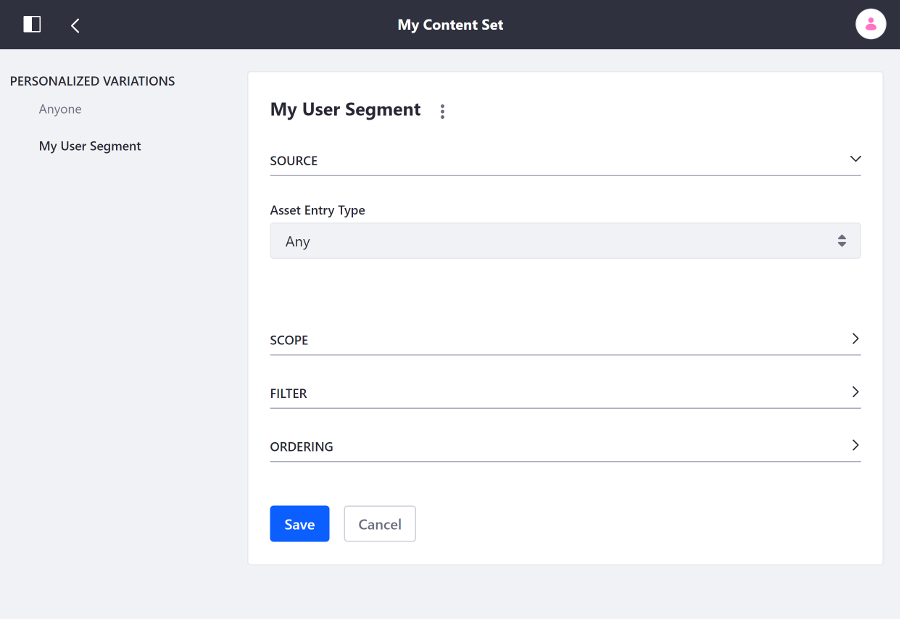
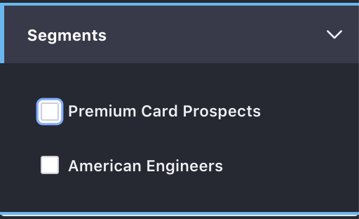

# Personalizing Site Experience

Liferay DXP comes out of the box with powerful tools to understand and deliver personalized experiences. The first step to delivering a personalized experience is to start with understanding, or Segmenting your users. User Segments are dynamically assigned User collections. Instead of manually assigning Users to the collection, Users are assigned to Segments based on shared attributes or behaviors.

## Segmentation

Using the Segment Builder, you can group similar Users by user profile attributes, behavior, Site Role, and more.



See [Creating and Managing a Segment](./segmentation/creating-and-managing-user-segments.md) to get started.

```note::
   User Segments can also be used to assign Roles. See `Assigning Roles to User Segments <../../users-and-permissions/roles-and-permissions/assigning-roles-to-user-segments.md>`_ for more information.
```

### Tracking Behavior of User Segments with Liferay Analytics Cloud

Supercharge your Segments by integrating your Liferay DXP instance with Liferay Analytics Cloud. Analytics Cloud integrates DXP with Salesforce(tm) and other data sources to provide even more ways to understand your user base.

Integration with Analytics Cloud provides in-depth, machine-learning powered, data analytics capabilities to help you understand user behavior and engagement for every page of your DXP Site. Analytics Cloud enables you to see user behavior and interaction with both standard and targeted content. See [Getting Analytics for User Segments](./segmentation/getting-analytics-for-user-segments.md) for more information.



## Personalization

Once you've [created User Segments](./segmentation/creating-and-managing-user-segments.md), you can begin tailoring Site experiences specific to a User Segment. Content Page Personalization and Content Set Personalization are two methods you can use to deliver personalized user experiences.

### Content Pages

Content Page Personalization dynamically changes the page layout and content based on who is viewing the page. You can create *Experiences* for any [Content Page](../creating-pages/building-and-managing-content-pages/building-content-pages.md) which provide different text, images, widgets, and even different layouts based on the User Segment criteria of the User viewing the page. See [Content Page Personalization](./experience-personalization/content-page-personalization.md) for more information.



### Content Sets

Content Sets <!-- Link to Content Sets documentation placeholder --> organize and display content. Content Set Personalization provides selection of Content Sets based on User Segments. This means the Content Set which displays in a given context is determined by the User Segment criteria. For example, you could use a Content Set to display "featured" articles at the top of a page. Then you could create User Segments containing users who should receive more specialized content, rather than the default. Those Segments would then see content personalized to their interest rather than the default. See [Content Set Personalization](./experience-personalization/personalizing-collections.md) for more information.



### Previewing User Experiences

You can preview the different experiences that users can have on a page by clicking the *Simulation* button () at the top of the page and selecting a User Segment from the *Segments* selection to preview the page as a member of that User Segment.

Viewing the perspective of a User Segment previews any personalizations for Content Pages or Content Sets for that User Segment.



## Next Steps

* [Creating and Managing a Segment](./segmentation/creating-and-managing-user-segments.md)
* [Content Page Personalization](./experience-personalization/content-page-personalization.md)
