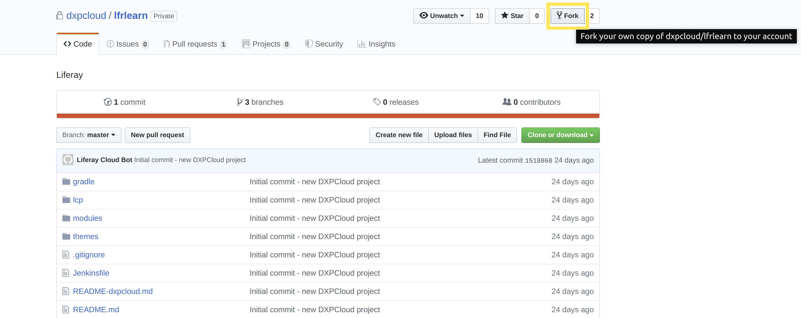
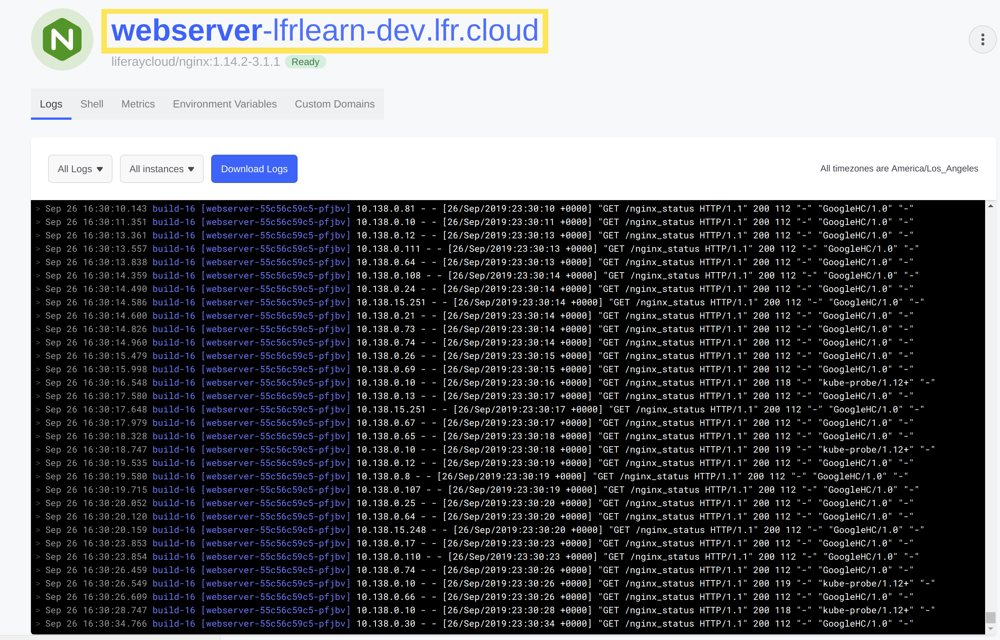

# Walking Through the Development Life Cycle

This article outlines the path developers will take when deploying their changes to their instances on DXP Cloud.

Although there are multiple paths for deploying to an environment, all paths begin with adding changes to the repository.

* [Adding Changes to the Repository](#adding-changes-to-the-repository)
* [CI Testing](#ci-testing)
* [Deploying Services](#deploying-services)

## Adding Changes to the Repository

Begin the deployment life cycle by adding a change into the GitHub repository. See []() for more information on setting up the Workspace on your local system.

The source for new code additions must be added into folders at the root of the repository: the `modules` folder for new modules, the `themes` folder for custom themes, and the `wars` folder for WARs. Code changes added to any of these locations will be automatically built and then deployed to the Liferay service after the build is deployed.

## CI Testing

By default, a build will run tests for any of the following: changes directly pushed to the repository, pull requests with changes sent to the repository, and changes deployed using the Command Line Interface. Any of these will automatically invoke testing these changes using the `CI` service in the `infra` environment.

Navigate to the `Builds` tab to see all builds that have been initiated from changes in the repository. If the build passes CI testing, then the Cloud console will offer the option in the UI to deploy that build to any applicable environment.

## Deploying Services

There are two main ways to deploy to a Liferay instance on DXP: deploying through the Command Line Interface, or deploying a successful build from the `Builds` tab in the DXP Cloud console.

### Option 1: Deploying Through the Command Line Interface

The quickest way to deploy services from a repository locally is by using the Command Line Interface (CLI). See []() for more information on setting up the CLI.

First, log in to the CLI:

```bash
lcp login
```

Answer `y` at the prompt to open a browser tab to authenticate into DXP Cloud. The CLI will wait for authentication from the browser to complete the command.

Next, deploy the services using any changes made in the local repository:

```bash
lcp deploy
```

Choose an environment to deploy to when prompted in the CLI. You may also be prompted to enter an ID for the project.



Once the command finishes running, the services will be successfully deployed to the chosen environment.

### Option 2: Deploying From a Build in DXP Cloud

First, commit the changes to the repository. Then, start a CI build in DXP Cloud by either directly pushing to the repository, or sending a pull request to a branch.

Next, navigate to the `Builds` tab for the desired environment. The option to deploy the build will appear once the tests complete successfully.



Click "Deploy Build to..." for any successful build to deploy to the environment of your choice. Normally, a new build will first be deployed to the `dev` environment. However, developers can directly deploy to any environment as long as they have permissions to do so.

