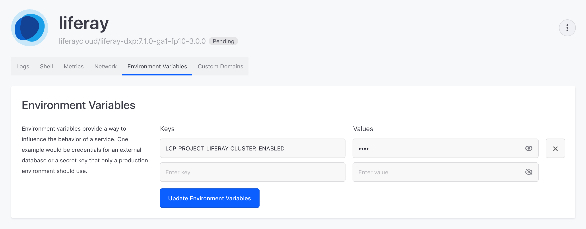

# Adding Environment Variables

Environment variables are a set of dynamic placeholders that can affect the way a service behaves within an environment.

There are two ways to define environment variables: via the DXP Cloud Management Console or configuring the `LCP.json` file for each service.

> **Note:** DXP Cloud will always apply the most recent changes to settings. If the latest changes are made in the LCP.json file, upon restart, the environment variables will be reflected in the web console. However, if the environment variables are changed in the web console, the container will be restarted with those new configurations.

## Defining Environment Variables via the DXP Cloud Management Console

While logged into the DXP Cloud Management Console:

1. Click _Services_ in the left menu on the environment (for example, UAT).  
1. Click the *Environment Variables* tab.
1. Enter each environment variable as a key-value pair (for example, to enable clustering):
    * **Key**: `LCP_PROJECT_LIFERAY_CLUSTER_ENABLED`
    * **Value**:  `false`
1. Click *Update Environment Variables*.

The service now restarts with the updated environment variables.



## Adding Environment Variables via LCP.json

Environment variables can be added by configuring the `LCP.json` by using the `env` property. This example adds the environment variables `MYSQL_ROOT_PASSWORD` and `MYSQL_ROOT_USER` with the values `pass` and `example`, respectively:

```json
{
  "id": "db",
  "image": "mysql",
  "env": {
    "MYSQL_ROOT_PASSWORD": "pass",
    "MYSQL_ROOT_USER": "example"
  }
}
```

## Additional Information

* [Configuration via LCP JSON](../10-reference/02-configuration-via-lcp-json.md)
* [Database Service](../07-platform-services/01-database-service.markdown)
* [Networking Environment Variables Reference](../08-infrastructure-and-operations/03-networking/06-networking-environment-variables-reference.md)
