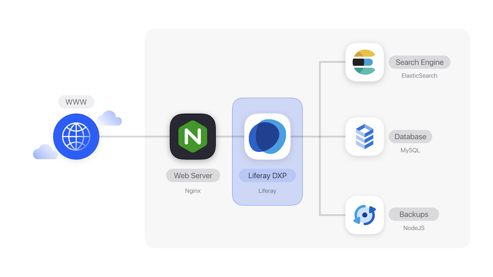

# Introduction to the Liferay DXP Service

The Liferay DXP service is the heartbeat of any project. It runs the application's Liferay DXP instance and interacts with other services like the web server, Elasticsearch, and MySQL database.



The Liferay DXP service in DXP Cloud can be used in many of the same ways as an on-premise instance of Liferay DXP. However, there are also several differences in configuration and development workflow when working with an instance in DXP Cloud.

* [Choosing a Version](#choosing-a-version)
* [Deployment](#deployment)
* [Configuration](#configuration)
* [Enabling Clustering](#enabling-clustering)
* [Environment Variables](#environment-variables)
* [Running Scripts](#running-scripts)

## Choosing a Version

The version of Liferay DXP that you are using is configured within the `gradle.properties` file at the root of your Git repository.

```properties
liferay.workspace.lcp.liferay.image=liferaycloud/liferay-dxp:7.2.10-ga1-3.0.10
```

This version includes the specific service pack and fix pack that your Liferay DXP instance will be based on.

You can check the [Services Changelog](https://help.liferay.com/hc/en-us/sections/360006251311-Services-Changelog) for DXP Cloud to see a reference for each new release. Each new Service update includes Docker images that you can use for your instance.

Use the new version from the release notes to update the `liferay.workspace.lcp.liferay.image` property value. The new Docker image will be used when your instance starts up or the next time you deploy the Liferay service from your repository. You can also use the Docker images for new releases to upgrade the properties for your other services.

> **Note:** if any `LCP.json` files in your repository directly reference the Docker image for a version of Liferay, then these will need to be updated as well when upgrading to a new Docker image.

## Deployment

Deploying custom additions to Liferay DXP involves adding the new module, license, or hotfix to the appropriate locations in the Git repository, and then pushing the additions to the Git repository. See [Overview of the Deployment Workflow](./overview-of-the-deployment-workflow.md) for more information on how this works, and see [Adding Files to Deploy to the Liferay DXP Service](./adding-files-to-deploy-to-the-liferay-dxp-service.md) for more information on the types of files you can deploy.

## Configuration

Applying configurations to the Liferay service, like `portal.properties` changes, requires adding them to the Git repository and pushing the changes to Git. For more information on adding these configuration files, see [Configuring the Liferay DXP Service](./configuring-the-liferay-dxp-service.md).

## Enabling Clustering

Clustering Liferay DXP in DXP Cloud is a very simplified process compared to doing so in Liferay DXP. Support for clustering is available and enabled out-of-the-box in DXP Cloud. Additional configurations for clustering behavior and scale does require a few extra steps. See [Setting Up Clustering in DXP Cloud](./setting-up-clustering-in-dxp-cloud.md) for more information.

## Environment Variables

Name                                  | Default Value | Description  |
------------------------------------- | ------------- | ------------ |
`LCP_PROJECT_LIFERAY_CLUSTER_ENABLED` | `true`       | Whether to enable clustering and communication between nodes. |
`LCP_PROJECT_MONITOR_DYNATRACE_TENANT` |               | A string with eight characters. It's part of the URL (prefix) of your Dynatrace SaaS account. |
`LCP_PROJECT_MONITOR_DYNATRACE_TOKEN` |               | A string with 22 characters that you can find in your Dynatrace account at *Deploy Dynatrace* &rarr; *Start installation* &rarr; *Set up PaaS monitoring* &rarr; *Installer Download*. |
`LIFERAY_JAVA_OPTS` | | JVM options that will be appended to `CATALINA_OPTS` to override the default recommended options. |

## Scripts

Any `.sh` files found in the `script` folder are automatically run prior to starting the service. Scripts may be used for more extensive customizations. However, use caution when doing so. This is the most powerful way to customize Liferay DXP and it can cause undesired side effects.

For example, to include a script that removes all log files, place it in the following directory structure within the project's Git repository:

    lcp
    └──liferay
        ├── script
        │ └── remove-log-files.sh
        └── LCP.json
