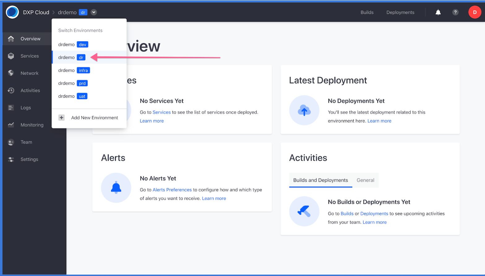
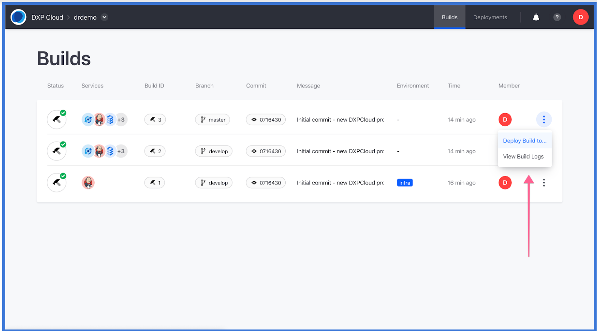
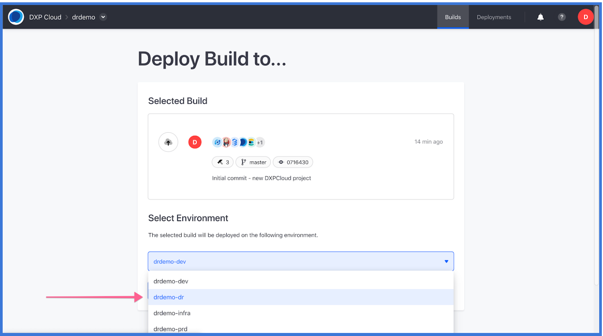
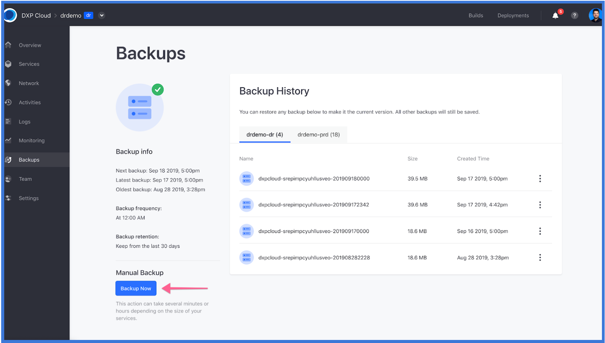
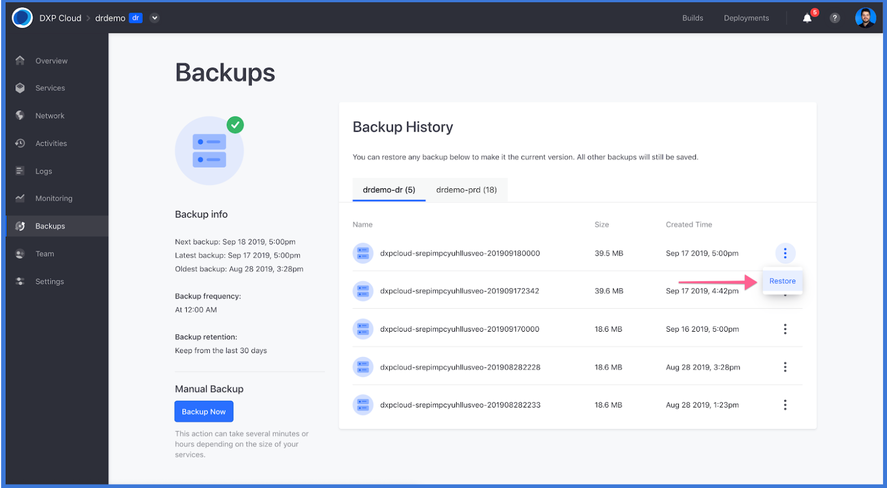

# Disaster Recovery

## Introduction

DXP Cloud provides two ways for customers to take advantage of the Disaster Recovery (DR) procedure in the case of major incidents.

* **Automatic Disaster Recovery**: DXP Cloud performs automatic disaster recovery protocols by replicating services between three Availability Zones in different geographic locations within the same Region. In case any of the Availability Zones become unavailable, the Load Balancer will automatically route to the remaining Availability Zones without requiring DNS changes on the customer side. In this situation, _no action is required from the customer during an incident_.

* **Cross-Region Disaster Recovery**: The Disaster Recovery procedure as explained in this document is only necessary when there is a compromise in all three Availability Zones in the same region at the same time. In this situation, customers will use the DR environment and follow the instructions explained in this document.

## Initial Setup

Liferay offers a fifth DXP Cloud environment to manage a _cross region_ disaster. DXP Cloud customers wishing to use this Disaster Recovery (shortened to *DR*) environment must purchase this additional environment first by contacting their sales representatives. Liferay will create the disaster recovery environment. The environment is listed with the other available environments (dev, infra, UAT, and prod).

### Verify VPN Settings in the DR environment

Communications between the *DR* environment and production may go through a VPN. To ensure the two environments are connected:

1. Navigate to _Settings_ in the left menu.
1. In the _VPN_ section, enter the following:
    * **VPN Type**: OpenVPN
    * **Server Address**: (server address)
    * **Account Name**: (administrator's email address)
    * **Password**: (administrator's password)
    * **Certificate**: (Certificate code)
    * **Forwarding IP**: (IP address)
    * **Forwarding Port**: (port number)
    * **Local Hostname**: (VPN)
    * **Local Port**: (local port number)
1. Click _Connect VPN_.

### Deploy the Latest Stable Build from Production to the DR environment

1. Click _Builds_ in the top navigation bar.
1. Click the _3-dot_ icon then _Deploy Build to..._ next to the most recent build.

    

1. Select the _dr_ environment from the dropdown menu.

    

1. Click _Deploy Build_.

## Manual Data Recovery Workflow

The workflow below contains the steps required in order to restore a backup of database and documents from the Production environment to the Disaster Recovery environment.

It covers both the event of a disaster happening and also what to do after the disaster is no longer present.

### Once a Disaster Happens

1. Navigate to _Backups_ on the **DR** environment.
1. Click the _3-dot_ icon then _Restore_ from the most recent backup.

   

1. Navigate to _Services_ on the left menu.
1. Click on _webserver_ in the list of Services.
1. Click the _Custom Domains_ tab.

1. Remove the custom domain from the Production environment.
1. Update the DNS records. For more information, see the [Custom Domain](https://help.liferay.com/hc/en-us/articles/360032856292) article.
1. Click _Update Custom Domain_.

## After the Disaster

### Create a Manual Backup in the DR environment

Before moving back to the Production environment, it is important to create a new backup from the DR environment since there has been new data generated.

1. Navigate to _Backups_ on the **DR** environment.
1. Click _Backup Now_.

    

### Restore the Manual Backup from DR to Production environment

1. Navigate to _Backups_ on the **DR** environment.
1. Click the _3-dot_ icon from the most recent back up then click _Restore_.

    

1. Select the production environment.

    

1. Click _Deploy Build_.

### Configure Web Server custom domain in the Production environment

1. Navigate to _Services_ on the left menu.
1. Click on _webserver_ in the list of Services.
1. Click the _Custom Domains_ tab.

1. Remove the custom domain from the Production environment.
1. Update the DNS records. For more information, see the [Custom Domain](https://help.liferay.com/hc/en-us/articles/360032856292) article.
1. Click _Update Custom Domain_.

## Additional Information

Below is a diagram of how the restoration process from production to the disaster recovery environment looks like:

