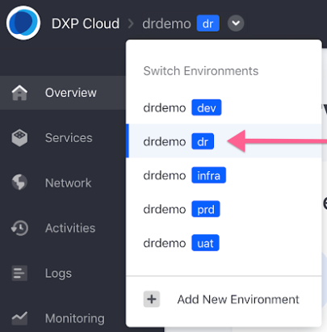
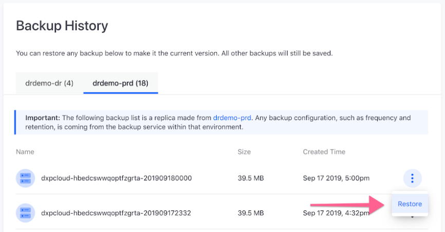
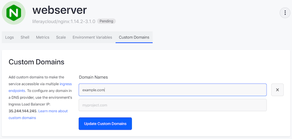
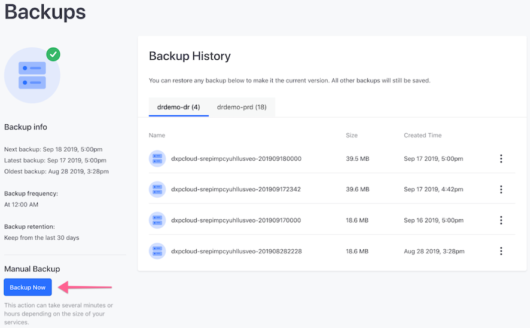
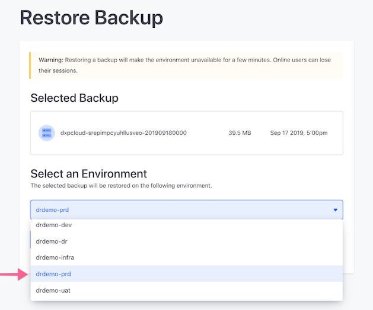
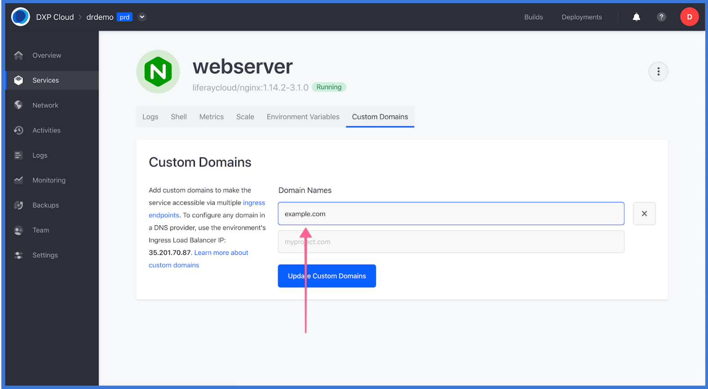

# Disaster Recovery

DXP Cloud provides two ways for customers to take advantage of the Disaster 
Recovery (DR) procedure in the case of major incidents. 

**Automatic Disaster Recovery**: DXP Cloud performs automatic disaster recovery 
protocols by replicating services between three Availability Zones in different 
geographic locations within the same Region. In case any of the Availability 
Zones become unavailable, the Load Balancer will automatically route to the 
remaining Availability Zones without requiring DNS changes on the customer side. 
In this situation, *no action is required from the customer during an incident*. 

**Cross-Region Disaster Recovery**: The Disaster Recovery procedure as explained 
in this document is only necessary when there is a compromise in all three 
Availability Zones in the same region at the same time. 

This article documents the steps required to help a customer recover data 
manually during a cross-region disaster: 

-   [Initial Setup](#initial-setup)
-   [During an Incident](#during-an-incident)
-   [Post-incident Recovery](#post-incident-recovery)

## Initial Setup

Liferay offers a fifth DXP Cloud environment to manage a cross region disaster. 
In this scenario, assume that a production environment is stored in the 
*eu-west-2* region and the region is compromised. To prevent downtime and
data loss on the production environment, the Disaster Recovery environment
should be shifted to outside the region of operation, such as *us-west1*. This
fifth Disaster Recovery (shortened to DR) environment thus serves as a backup
to store new user data generated during the incident.

DXP Cloud customers wishing to set up a Disaster Recovery environment must first
contact their sales representative in order for the DR environment to be
provisioned. This new environment is listed with the other available
environments (dev, infra, UAT, and prod).

### Verify VPN Settings in the DR environment

Communications between the DR environment and production may go through a VPN. 
To ensure the two environments are connected:

1.  Click the DR environment's *Settings* tab in the left menu. 

2.  In the VPN section, enter the following: 

    -   **VPN Type**: OpenVPN
    -   **Server Address**: The server address. 
    -   **Account Name**: The administrator's email address. 
    -   **Password**: The administrator's password. 
    -   **Certificate**: The certificate code.
    -   **Forwarding IP**: The forwarding IP address.
    -   **Forwarding Port**: The forwarding port number.
    -   **Local Hostname**: The VPN's hostname.
    -   **Local Port**: The local port number.

3.  Click *Connect VPN*. 

For more information on connecting to a VPN, see 
[VPN Connection](/docs/-/knowledge_base/dxp-cloud/vpn-connection). 

### Deploy the Latest Stable Build from Production to the DR Environment

Now you must deploy the latest stable build on production to the DR environment. 
To do so, follow the instructions in 
[Deploying to a Different Environment](/docs/-/knowledge_base/dxp-cloud/deployments#deploying-to-a-different-environment) 
to deploy that build to the DR environment. 

## During an Incident

Continuing the example above, the production environment hosted in the 
*eu-west-2* region is scheduled to be backed up hourly at 2:00 PM local time and 
that the region is compromised at 2:30 PM local time. Because no backups have 
been generated in the intervening half hour, it is necessary to restore a backup 
of database and documents from the Production environment to the Disaster 
Recovery environment. The last stable environment is the version created at 2:00 
PM.

### Restore the Latest Stable Environment

Follow these steps to restore the latest stable backup of production to the DR 
environment: 

1.  In the DR environment, click the *Backups* tab on the left. 

2.  The Backup History lists the backups in two tabs: one for the DR environment 
    and one for the production environment. Click the tab corresponding to the 
    production environment. 

3.  For the latest stable backup in the production environment, click the 
    *Actions* button 
    () 
    then select *Restore*. 

### Configure the Web Server's Custom Domain

The web server service's custom domain in the DR environment must match that of 
the original production environment. You must also delete that configuration 
from the production environment. Follow these steps to do so: 

1.  In the DR environment, select *Services* in the left menu. 

2.  Click *webserver* in the list of Services. 

3.  Click the *Custom Domains* tab and configure the custom domain to match that 
    of the production environment. 

4.  Navigate to the same setting in the production environment, and remove the 
    custom domain configuration. 

5.  Update the DNS records. For more information, see 
    [Custom Domains](/docs/-/knowledge_base/dxp-cloud/custom-domains). 

## Post-incident Recovery

Once the regional incident is over, you must shift back to the original region's 
production environment (*eu-west2* in this example). Do this via these steps: 

-   [Create a Manual Backup in the DR Environment](#create-a-manual-backup-in-the-dr-environment)
-   [Restore the Manual Backup from DR to Production](#restore-the-manual-backup-from-dr-to-production)
-   [Update the Web Server Custom Domain in Production](#update-the-web-server-custom-domain-in-production)

### Create a Manual Backup in the DR Environment

During the incident, the DR environment functions as the production environment 
and therefore contains new data. To preserve this data, you must back up the DR 
environment. Follow these steps to do so: 

1.  In the DR environment, click *Backups* in the menu on the left. 

2.  Click *Backup Now*. 

### Restore the Manual Backup from DR to Production

1.  In the DR environment, click *Backups* in the menu on the left. 

2.  The Backup History lists the backups in two tabs: one for the DR environment 
    and one for the production environment. Click the tab corresponding to the 
    DR environment. 

3.  For the most recent backup (the one you just created), click the 
    *Actions* button 
    () 
    then select *Restore*. 

4.  Select the production environment and click *Deploy Build*.

### Update the Web Server Custom Domain in Production
<!-- 
Shouldn't this say to restore the custom domain setting from DR to production?
-->

Because you updated the webserver service's custom domain in the DR environment, 
you must update these settings again so that all traffic is redirected back to 
the correct domain. 

1.  Navigate to _Services_ on the left menu.

2.  Click on _webserver_ in the list of Services.

3.  Click the _Custom Domains_ tab.

1. Remove the custom domain from the Production environment.

1. Update the DNS records. For more information, see the [Custom Domain](https://help.liferay.com/hc/en-us/articles/360032856292) article.

1. Click _Update Custom Domain_.

## Additional Information
<!--
I don't understand this diagram. It says "restoring from production to the 
disaster recovery environment," but the arrow is going from the DR environment 
to the automated backup. 
-->

Below is a diagram of how the restoration process from production to the 
disaster recovery environment looks like:

