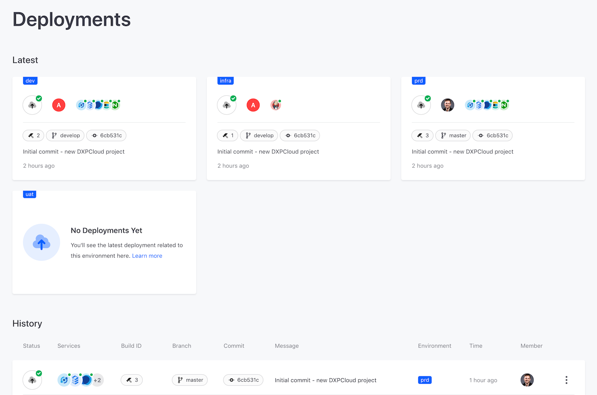
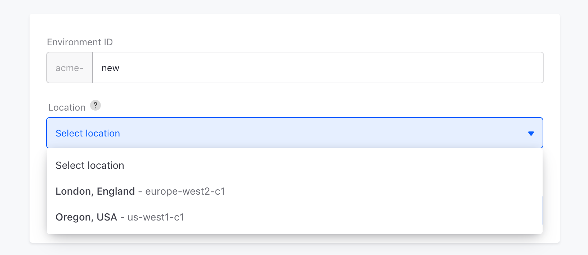

# Builds and Deployments

Your application must go through a build phase before it can be deployed to an environment. This initial build phase is when DXP Cloud gets the Docker images from your CI, creates your container environment, and runs all tasks and build configurations specified in your image. 

You can check your environment's build process by clicking the *Builds* tab on 
the top-right side of each environment page. 


## Deployments

If your service builds without errors it can be deployed to an environment. Once 
triggered, the deployment process pushes the build to the registry and makes it 
available to your users. During the deployment phase, DXP Cloud runs health 
checks on your services. If these checks succeed, the deployment is healthy and 
ready. 

To see your deployments, go to your environment page and click the *Deployments* 
tab on the top-right side. 



### Deployment Types

DXP Cloud provides two deployment types: 

1.  **Deployment:** Meant for stateless applications. Volumes mapped on 
    `LCP.json` support NFS disks, however, making the service function as a 
    stateless-stateful hybrid. This deployment type is valuable for applications 
    that require one or more of the following: 

    -   Unstable, random network identifiers (e.g., `liferay-89f9f559`, 
        `liferay-d1267401`). 
    -   Stable, persistent shared storage (NFS). Volumes mapped on `LCP.json` 
        mount a shared disk for all instances of the same service (e.g., on the 
        Liferay DXP service). The Document Library folder takes advantage of 
        this ability by sharing the same directory between all instances. 
        Dedicated SSDs are not allowed. 
    -   Unordered deployment and scaling. 
    -   Unordered, automated rolling updates. 

2.  **StatefulSet:** Meant for stateful applications. StatefulSet deployment is 
    valuable for applications that require one or more of the following: 

    -   Stable, unique network identifiers (e.g., `search-0`, `search-1`). 
    -   Stable, persistent dedicated storage (SSD). Volumes mapped on `LCP.json` 
        mount a dedicated, high-performance disk per instance. NFS disks aren't 
        allowed. 
    -   Ordered, graceful deployment and scaling. 
    -   Ordered, automated rolling updates. For a StatefulSet with N replicas, 
        pods being deployed are created in order from `{0..N-1}`. When pods are 
        deleted, they're terminated in reverse order from `{N-1..0}`. 

| **Note:** For zero-downtime deployments, you must use the Deployment type. 

| **Note:** If you don't specify a deployment type, the default is Deployment. 

You can set the deployment type in your `LCP.json`: 

```json
{
    "id": "dxp",
    "kind": "StatefulSet"
}
```

### Service Health Probes

You can use two probe types to validate your service's health: 

**Liveness Probe:** Indicates whether the service is running. 

**Readiness Probe:** Indicates whether the service is ready to receive requests. 

For each probe, you can use a URL request or an executable command to validate 
the status: 

**URL Request (path/port):**

```json
"livenessProbe": {
  "httpGet": {
    "path": "/status",
    "port": 3000
  },
  "initialDelaySeconds": 40,
  "periodSeconds": 5,
  "successThreshold": 5
}
```

**Executable Command:** 

```json
"readinessProbe": {
  "exec": {
    "command": ["cat", "/tmp/healthy"]
  },
  "initialDelaySeconds": 40,
  "periodSeconds": 5,
}
```

Here are descriptions for each property you can use in the probes: 

`initialDelaySeconds`: Number of seconds after the container has started before 
the probe is initiated. 

`periodSeconds`: How often (in seconds) to perform the probe. The default is 
`10`; the minimum is `1`. 

`timeoutSeconds`: Number of seconds after which the probe times out. The default 
and minimum is `1`. 

`successThreshold`: Minimum consecutive successes for the probe to be considered 
successful following a failure. The default and minimum is `1`. Must be `1` for 
liveness. 

`failureThreshold`: The number of times DXP Cloud repeats a failed probe before 
giving up. For a liveness probe, giving up means the service will restart. For a 
readiness probe, giving up means the probe will be marked as Failed. The default 
is `3`; the minimum is `1`. 

## Deploying to a Different Environment

To deploy to a completed build to any environment, select *Deploy Build* to from the build's Actions button (). 


## Deployment Region

You can configure each environment to host the services in a specific region. 
This configuration must be set when creating the environment. Contact support to 
request a new deployment region. 


