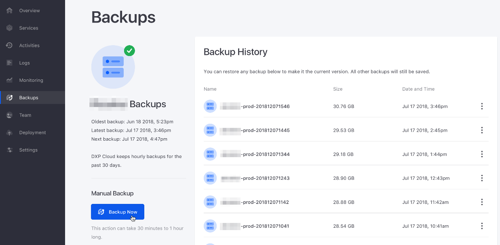
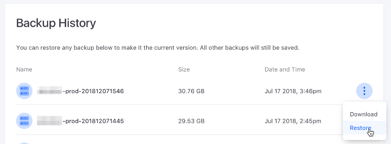

# Backup and Restore

It's important for production applications' data to be safe. DXP Cloud can 
backup and restore data. All backups save a dump of the database, environment 
volumes, and the Documents and Media folder. 

| **Note:** The Backups tab is only available on production environments. From this tab, you can restore backups to any environment that a user has access to. 

## Creating a Backup

To create a manual backup, go to your production environment's page, select the 
*Backups* tab in the left menu, and click *Backup Now*. You can also use 
environment variables to set an interval for automated backups. See 
[Backup Service](/docs/-/knowledge_base/dxp-cloud/backup-service) 
to learn more about configuring this service. 

## Restoring from a Backup

The Backups tab contains a table that shows each backup in the environment. The 
table displays each backup's name, size, and creation date and time. To restore 
from a backup, click that backup's *Actions* button 
() 
in the table and select *Restore*. 

