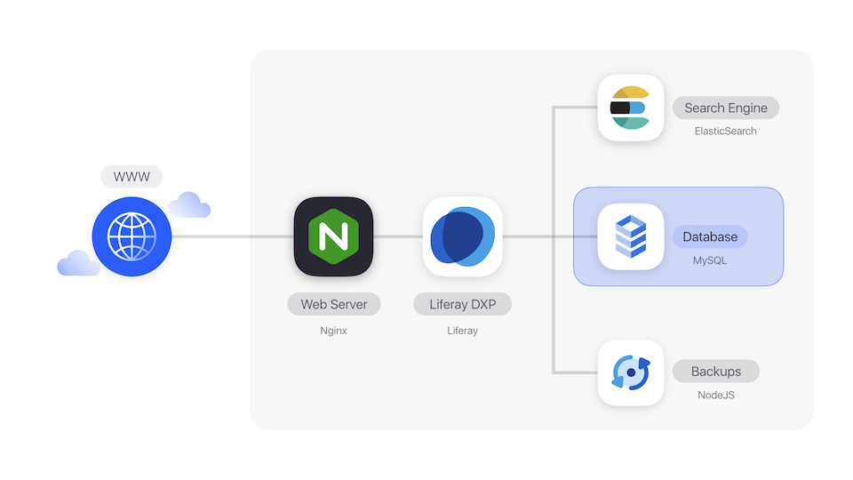

# Database Service (MySQL)

The database service (MySQL) is a distributed relational database service that 
simplifies the setup, operation, and scaling of your applications. It's a 
private service inside your application environment and can only communicate 
with your other services, not the public Internet. 



## Environment Variables

You can set these environment variables to configure the database service. 
When setting `LCP_MASTER_USER_NAME`, `LCP_MASTER_USER_PASSWORD`, and 
`LCP_DBNAME`, make sure to use the same values for other services that depend on 
the database service (e.g., the backup and Liferay DXP services). You should set 
these variables before the first deployment. If a build is generated with new 
values for these variables, subsequent deployments will fail. It may be viable 
in a development environment to delete services and update the `LCP.json` file 
with new values for these variables, but this isn't viable in a production 
environment. 

Name                       | Default Value              | Description      |
-------------------------- | -------------------------- | ---------------- |
`LCP_DBNAME`               | `lportal`                  | Database name.   |
`LCP_MASTER_USER_NAME`     | `dxpcloud`                 | Master username. |
`LCP_MASTER_USER_PASSWORD` | `LCP_PROJECT_MASTER_TOKEN` | Master password. |

#### Google Cloud MySQL Flags

You can pass MySQL flags in as environment variables. The available flags are 
listed in the 
[Google Cloud documentation](https://cloud.google.com/sql/docs/mysql/flags). 
Each flag must be prepended with `LCP_GCP_DATABASE_FLAG_` to work in Liferay DXP 
Cloud. Below are common flags that can be useful for debugging in a development 
environment, but should NOT be used in a production environment as they have 
significant performance costs. 

| **Warning:** As noted in Google's documentation, some database flag settings can affect instance availability or stability. Be very careful when using these flags and follow Google's [Operational Guidelines](https://cloud.google.com/sql/docs/mysql/operational-guidelines). 

Name                                   | Acceptable Value | Default Value |
-------------------------------------- | ---------------- | ------------- |
`LCP_GCP_DATABASE_FLAG_GENERAL_LOG`    | `on, off`        | `off`         |
`LCP_GCP_DATABASE_FLAG_SLOW_QUERY_LOG` | `on, off`        | `off`         |

## Managing Your Database

You can use the 
[Adminer](https://hub.docker.com/_/adminer) 
service to manage your database. With Adminer deployed in an environment, you 
can create, delete, modify, or visualize the environment's database. You can 
also export/import a database to/from any of its supported file extensions 
(e.g., `.sql`, `.csv`, `.tsv`). 

Follow these steps to add Adminer to your environment: 

1.  Go to the repository's `lcp` folder and create the `adminer` folder. 

2.  Inside `lcp/adminer`, create the `lcp.json` file using the following code as
    a template. Note that the `loadBalancer` property ensures that Adminer 
    traffic uses HTTPS and therefore is secure: 

    ```json
    {
      "cpu": 1,
      "dependencies": [
        "database"
      ],
      "env": {
        "ADMINER_DEFAULT_SERVER": "database"
      },
      "id": "adminer",
      "image": "adminer:4.7.0",
      "livenessProbe": {
        "httpGet": {
          "path": "/",
          "port": 8080
        },
        "initialDelaySeconds": 300
      },
      "loadBalancer": {
        "targetPort": 8080
      },
      "memory": 1024,
      "ports": [
        {
          "external": false,
          "port": 8080
        }
      ],
      "readinessProbe": {
        "httpGet": {
          "path": "/",
          "port": 8080
        },
        "initialDelaySeconds": 240
      }
    }
    ```

3.  Commit and push these changes to your repository. 

4.  Go to your environment's services and access the Adminer service. 

5.  Log in with your database service's username and password. 

Note that Adminer's default upload size is 2 MB. To import larger files, you 
must store PHP configurations from your container at 
`/usr/local/etc/php/conf.d`. Here are some example Adminer configurations: 

-   `upload_max_filesize = 500M`
-   `post_max_size = 500M`
-   `memory_limit = -1`
-   `max_execution_time = 0`
