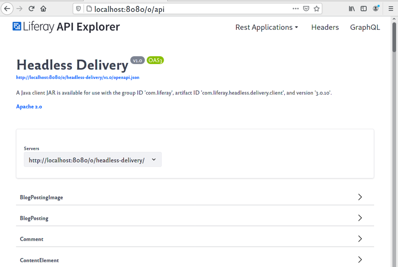
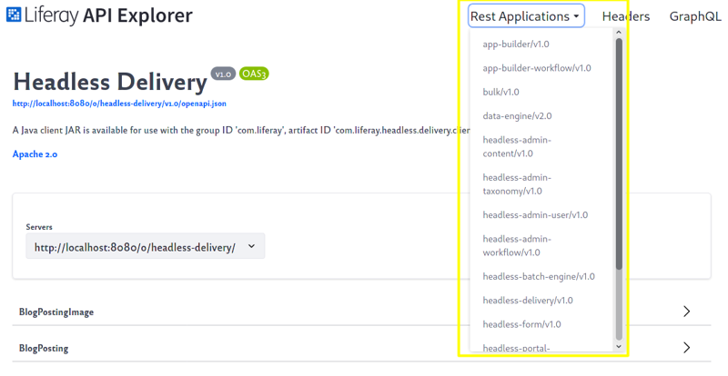
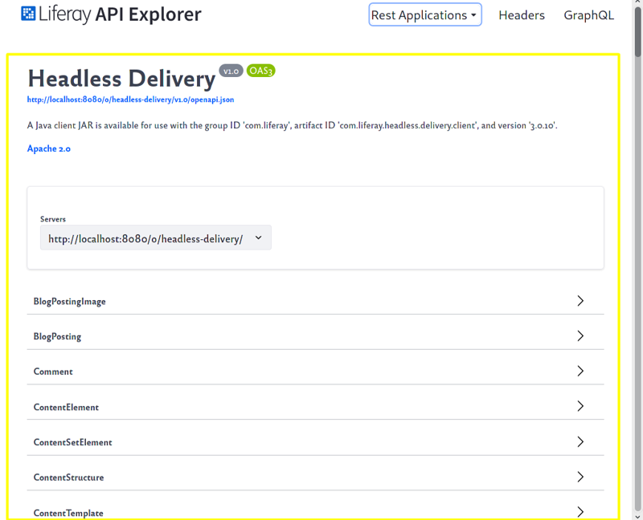
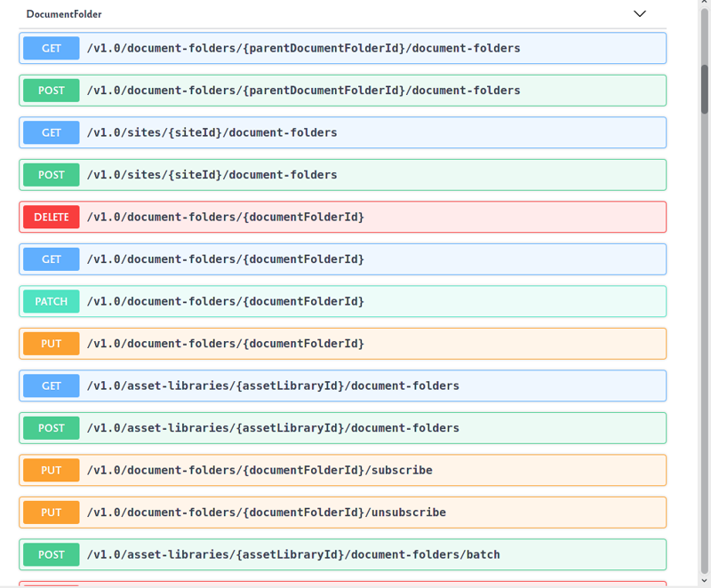
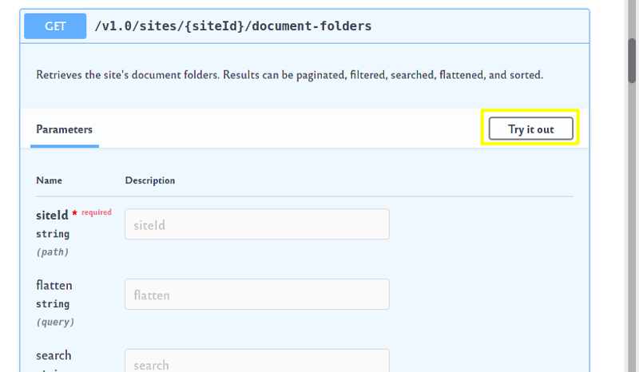
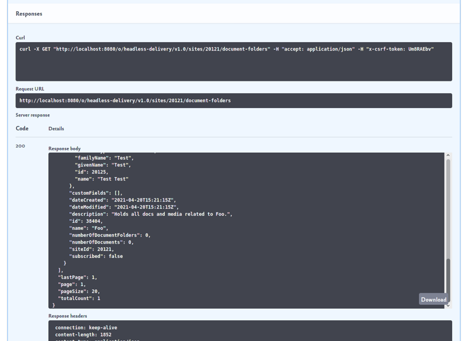

# REST API Project Guidelines

Liferay's REST APIs provide a powerful, easy-to-use way to use Liferay's services. For this reason, if an area of the product has a REST API, we want to demonstrate using it. 

Here are the things to consider as you're creating example REST API client projects. 

* [Exploring the API](#exploring-the-api)
* [Planning projects](#planning-projects)
* [Setting up a project](#setting-up-a-project)
* [Command name format](#command-name-format)
* [Opening access to a service](#opening-access-to-a-service)
* [Developing curl commands](#developing-curl-commands)
* [Developing Java clients](#developing-java-clients)
    * [Configuring dependencies](#configuring-dependencies)
    * [Compiling classes](#compiling-classes)
    * [Running classes](#running-classes)
* [Formatting source code](#formatting-source-code)
* [Sending code for review](#sending-code-for-review)
* [Appendix](#appendix)
    * [POST using JSON data](#post-using-json-data)
    * [POST using a multipart document](#post-using-a-multipart-document)

Start with exploring Liferay REST services. 

## Exploring the API

The API Explorer is a UI for browsing Liferay's REST APIs and trying them. Here are steps for exploring REST APIs.

1. Sign in to Liferay at http://localhost:8080.

1. Open the API Explorer at http://localhost:8080/o/api. The API Explorer appears.

    

    > **Tip:** Opening API Explorer in a separate browser tab gives you quick access to the other tab for signing back into Liferay if your session times out.

1. View the various REST applications by clicking the *Rest Applications* menu in the top right. The menu lists the available applications.

    

    The headless-delivery/v1.0 application has popular application services for resources, such as BlogPosting, Document, and more. There are applications for user management, forms, app builder, and more. As an example, we'll explore DocumentFolder services in the headless-delivery/v1.0 application.

1. Open the Headless Delivery services by clicking on *headless-delivery/v1.0* in the *Rest Applications* menu. The Headless Delivery API page appears.

    
    
    Here's what the page provides, starting from the top:

    * Link to the application's `openapi.json` file. This document defines the entire API.
    * Java client JAR artifact information. Your project's Java classes will depend on the REST application's client JAR.
    * Resource listing. The application's resources (e.g., BlogPostingImage, BlogPosting, etc.) are listed in alphabetical order. Each resource has an interface to examine the resource services and schemas, and to try out services. 
    * Schema listing. The *Schemas* section, below the entire resource listing, lists each resource schema.

1. In the resource listing, find *DocumentFolder* and click on it. The *DocumentFolder* page lists the service endpoints.

    

    Each row has an HTTP command and an endpoint URL. 

    | HTTP Command | Description |
    | :----------- | :---------- |
    | `GET` | Get a resource value or metadata about a resource |
    | `POST` | Create a resource instance |
    | `PATCH` | Update parts of a resource |
    | `PUT` | Replace a resource |
    | `DELETE` | Remove a resource |

1. Click DocumentFolder's *GET /v1.0/sites/{sideId}/document-folders* service. The test interface appears.

    

1. Click *Try it out* and fill in `siteId` with your site's ID (for example, `20121`). See [Consuming REST Services](https://learn.liferay.com/dxp/latest/en/headless-delivery/consuming-apis/consuming-rest-services.html#identify-the-site-containing-the-data) for details on finding your site ID.

1. Click *Execute* to execute the service. The service responses appear in the *Responses* section below the *Execute* button.

    

    The *Curl* field shows the curl command that was executed.
    
    > **Note:** You can base your curl commands off of ones like these.

    The service response *Response body* shows the site's DocumentFolder listing. `"totalCount": 1` means the site has one DocumentFolder. The example DocumentFolder's name (`name`) is `Foo`.

Now that you've explored a resource in the API Explorer, you can explore and plan for demonstrating services for your tutorial's area.

## Planning Projects

Each REST API has fundamental services and other services that are important to your users. One a user learns the fundamentals and sees a sampling of the services he wants to use, he'll be able to piece together service calls. So there's no need to demonstrate *all* of an API.

Here are suggested project types.

* Fundamental services for a resource include using each HTTP command to demonstrate CRUD operations. (Required)

    For example,

    1. POST a [resource] instance to a site or other common location
    1. GET the [resource] fields
    1. PATCH the [resource] 
    1. PUT another [resource] in its place
    1. DELETE the [resource]

* If your resource has "batch" services, demonstrate a sampling of them. Batch services involve creating or deleting multiple resource instances in one call. They typically involve various input formats such as CSV, XLS, or JSON.

* Demonstrate any other key services for the resource.

> **Note:** If there's another resource that's tightly coupled with your main resource (for example DocumentFolder is coupled with Document), include that resource's services too.

It's time to set up a project.

## Setting Up a Project

REST API client projects are similar to liferay-learn Java projects except they don't have Workspace or Gradle. They're built using the `javac` command and executed with the `java` command. Here's how to create a REST API client project:

1. Create random ID for your project. The ID is used in place of `[xxxx]` in the project folder's name `liferay-[xxxx].zip`. The ID must be unique to the liferay-learn repo. You can generate the ID using this command:

    ```bash
    tr -cd a-z1-9 < /dev/urandom | head -c 1000 | sed 's/.*\([a-z]\).*\([1-9]\).*\([a-z]\).*\([1-9]\).*/\1\2\3\4\n/
    ```

    Check for any existing projects that use the name. For example,

    ```bash
    find . -name liferay-xxxx.zip
    ````

1. Create a path for your project folder, following this format:

    ``` 
    [area]/developer-guide/api/[tutorial-name]/resources/liferay-[xxxx].zip
    ```

    For example, the project for the Document API Basics tutorial is here:

    ```bash 
    dxp/latest/en/content-authoring-and-management/documents-and-media/developer-guide/api/document-api-basics/resources/liferay-g9i6.zip
    ```
1. In your `liferay-[xxxx].zip` folder, create a `curl` folder for curl commands and a `java` folder for Java client classes.

Here's the resulting project structure:

```
liferay-[xxxx].zip/
├── curl/
└── java/
```

## Command Name Format 

The curl command and Java command files should follow this naming format:

```
[Resource(s)]_[ACTION]_[By|From|To][Something].[java|sh]
```

Here are examples for the [DocumentFolder and Document resources](https://github.com/jhinkey/liferay-learn/tree/lrdocs-9156-document-put/docs/dxp/latest/en/content-authoring-and-management/documents-and-media/developer-guide/api/document-api-basics/resources/liferay-g9i6.zip/curl).

| Curl | Java | Description |
| :--- | :--- | :---------- |
| `DocumentFolder_POST_ToSite.sh` | `DocumentFolder_POST_ToSite.java` | Create the document folder in the site. |
| `DocumentFolders_GET_FromSite.sh` | `DocumentFolders_GET_FromSite.java` | List a site's document folders. Note, the resource name is plural. |
| DocumentFolder_GET_FromId.sh | DocumentFolder_GET_FromId.java | Get a document folder's fields. |

You'll want to open access to your services too.

## Opening Access to a Service 

For testing purposes, a service can be accessed using basic authentication. The previous example passes in user credentials after the `-u` flag, like this:

```bash
-u "test@liferay.com:test"
```

In case the service is also tied in to the session, sign in to Liferay with that user too.

> **Tip:** In addition to a tab for the Liferay API browser, open a separate tab to the Liferay UI so you can sign your user back in if your session times out.

See [Consuming Rest Services](https://learn.liferay.com/dxp/latest/en/headless-delivery/consuming-apis/consuming-rest-services.html#make-the-service-call-using-credentials-with-access-to-the-data) for details on using credentials or see [Making Unauthenticated Requests](https://learn.liferay.com/dxp/latest/en/headless-delivery/consuming-apis/making-unauthenticated-requests.html).

It's time to develop your REST commands. Start with curl commands.

## Developing Curl Commands 

The API Browser's *Try it out* feature is a great way to see the services in action and to gather information about curl commands. See the previous section [Exploring the API](#exploring-the-api) for details.

A good service type t    o try first is one that gives you a listing of resource instances for your site (or some other scope). For example, this command lists DocumentFolder instances for a site that has the ID `20121`.

```bash
curl \
	"http://localhost:8080/o/headless-delivery/v1.0/sites/20121/document-folders" \
	-u "test@liferay.com:test"
```

> **Note:** GET commands are implicit--they don't require specifying the GET action.

Organize command arguments alphabetically, starting with upper-case flags and ending with lower-case flags. For example,

```bash
curl \
	-H "Content-Type: application/json" \
	-X POST \
	"http://localhost:8080/o/headless-delivery/v1.0/sites/${1}/document-folders" \
	-d "{\"name\": \"Goo\"}" \
	-u "test@liferay.com:test"
```

| Line | Description |
| :--- | :---------- |
| `curl \` | The curl command has its own line. |
| *\<tab\>* `-H "..." \` | The upper-case flags and their values are listed first alphabetically. |
| *\<tab\>* `-X POST \` | The HTTP action has its own line. |
| *\<tab\>* `"http://..." \` | The endpoint has its own line. |
| *\<tab\>* `-d "..." \` | The lower-case flags and their values are listed alphabetically. |
| *\<tab\>* `-u "..."` | The last line has no backslash. |

Strip out non-essential options that you might get from the API Explorer curl commands. See the Document API Basics [curl commands](https://github.com/liferay/liferay-learn/tree/master/docs/dxp/latest/en/content-authoring-and-management/documents-and-media/developer-guide/api/document-api-basics/resources/liferay-g9i6.zip/curl) for examples.

## Developing Java Clients

You must call the service APIs with Java too. The user should be able to compile your client classes in the local folder (`java/`) using a `javac` command and run them using a `java` command.

### Researching Examples of Using Resource 

The test case classes in <https://github.com/liferay/liferay-portal/blob/master/modules/apps/headless/headless-delivery/headless-delivery-test/src/testIntegration/java/com/liferay/headless/delivery/resource/v1_0/test/> are a good place to start learning a resource's Java interface.

#### Initializing a Resource

The `setup` method initializes the resource. For example, the [BaseDocumentFolderResourceTestCase#setup](https://github.com/liferay/liferay-portal/blob/master/modules/apps/headless/headless-delivery/headless-delivery-test/src/testIntegration/java/com/liferay/headless/delivery/resource/v1_0/test/BaseDocumentFolderResourceTestCase.java) method creates a builder and then uses the builder to create a resource instance.

```java 
DocumentFolderResource.Builder builder =
	DocumentFolderResource.builder();

documentFolderResource = builder.authentication(
	"test@liferay.com", "test"
)
```

#### Calling Resource Services 

All resources services are represented by Java methods. 

Find and examine your resource's Javadoc in the [REST API Javadoc](https://docs.liferay.com/dxp/apps/headless/latest/javadocs/). For example, the headless delivery resource Javadoc is at <https://docs.liferay.com/dxp/apps/headless/latest/javadocs/com/liferay/headless/delivery/resource/v1_0/package-summary.html>.

Examine where test case classes call a service that interests you, or piece together a call using parts of calls that you see.

### Example: Posting a DocumentFolder

This client initializes a `DocumentFolder` resource and calls its `postSiteDocumentFolder` method.

```java
import com.liferay.headless.delivery.client.dto.v1_0.DocumentFolder;
import com.liferay.headless.delivery.client.resource.v1_0.DocumentFolderResource;

public class DocumentFolder_POST_ToSite {

	/**
	 * java -classpath .:* -DsiteId=1234 DocumentFolder_POST_ToSite
	 */
	public static void main(String[] args) throws Exception {
		DocumentFolderResource.Builder builder =
			DocumentFolderResource.builder();

		DocumentFolderResource documentFolderResource = builder.authentication(
			"test@liferay.com", "test"
		).build();

		DocumentFolder documentFolder =
			documentFolderResource.postSiteDocumentFolder(
				Long.valueOf(System.getProperty("siteId")),
				new DocumentFolder() {
					{
						name = "Foo";
					}
				});

		System.out.println(documentFolder);
	}

}
```

Here's what it does:

1. Get a `DocumentFolderResource.Builder`.
1. Use the `DocumentFolderResource.Builder` to authenticate a user with a `DocumentFolderResource` instance.
1. Call the `DocumentFolderResource.postSiteDocumentFolder` method, passing in a site ID and a `DocumentFolder` object specified using JSON. The JSON specifies the DocumentFolder schema's required field `name`.

> **note:** The `main` method's comment demonstrates running the class. It includes a parameter for passing in the site ID.

### Configuring Dependencies

Your client's dependencies must be copied/downloaded to the project's `java/` folder at site build time. The site build requires a `liferay-[xxxx].zip/../resources/update_example.sh` script for your project.

Example script:

```bash
#!/bin/bash

source $(git rev-parse --show-toplevel)/_common.sh

download_nexus_jar "com.liferay.headless.delivery.client"
```

The script above calls the `/_common.sh#download_nexus_jar` function to download the headless delivery client JAR from Liferay's Nexus repository to the current project's `java` folder.

Create a script to set up your dependencies.

1. Create a script at `resources/update_example.sh`.
1. Copy the content above into your script.
1. Replace `"com.liferay.headless.delivery.client"` with the name of the client JAR your services require.
1. In another terminal window, go to `liferay-learn/docs` and initialize your API project by running the `update_examples.sh` script against it. For example,

```bash
./update_examples.sh xxxx
```

The script invokes your `resources/update_example.sh` script which downloads the required JAR to your `liferay-[xxxx].zip/java/` folder.

### Compiling Classes

In your `java` folder, compile your code using `javac`.

```
javac -cp .:* *.java
```

### Running Classes 

Run your Java class, passing in any system properties it requires. For example,

```bash 
java -classpath .:* -DsiteId=1234 DocumentFolder_POST_ToSite
```

Once you've executed your class successfully, mention its execution command in a comment above your `main` method. For example, 

```java 
/**
 * java -classpath .:* -DsiteId=1234 DocumentFolder_POST_ToSite
 */
public static void main(String[] args) throws Exception {
```

Use `1234` in place of the ID value the user must specify.

## Formatting Source Code 

We're still working on a way to format source code in these projects.

For now, format them in another project: 

1. Copy your classes to another lifeary-learn Java project (e.g., to its `src/main/java` folder). 
1. Run `gradlew formatSource` as you normally would in that project.
1. Resolve any source formatting issues.
1. Copy your formatted classes back to your original project.

## Sending Code For Review 

Branches submitted for code review must contain only code changes--branches must not contain any new/modified articles. 

> **Tip:** Use a dedicated branch (free of any new/modified articles) for your example code. However, if you've included article changes in your branch, back them up (e.g., copy the articles to your Desktop) and then remove them from your branch.

Send a pull request to `jhinkey` (Jim Hinkey). He will review your code before sending it onward for final review and merging.

Thanks for submitting your example to Liferay!

## Appendix

### POST Using JSON Data

Here's an example that uses JSON to post an object to an endpoint.

```bash
curl \
	-H "Content-Type: application/json" \
	-X POST \
	"http://localhost:8080/o/headless-delivery/v1.0/sites/${1}/document-folders" \
	-d "{\"name\": \"Goo\"}" \
	-u "test@liferay.com:test"
```

The `-d "{\"name\": \"Goo\"}"` arguments specify the data--the document folder name. The header arguments `-H "Content-Type: application/json"` specify the data content uses the JSON format. `${1}` is a placehoder for the user to replace with a site ID. The action arguments `-X POST "http://localhost:8080/o/headless-delivery/v1.0/sites/${1}/document-folders"` specify the POST HTTP command and the endpoint. 

### POST Using a Multipart Document 

Services involving file content must use the multi-part form content type. The first part is a file and the other optional part can be any format. For example, this command posts a file to a service:

```bash 
curl \
	-F "file=@Document_POST_ToSite.sh" \
	-H "Content-Type: multipart/form-data" \
	-X POST \
	"http://localhost:8080/o/headless-delivery/v1.0/sites/${1}/documents" \
	-u "test@liferay.com:test"
```

The arguments `-F "file=@Document_POST_ToSite.sh"` specify the file. The header arguments `-H "Content-Type: multipart/form-data"` specify that the content is multipart form data. And the action arguments `-X POST "http://localhost:8080/o/headless-delivery/v1.0/sites/${1}/documents"` specify the POST HTTP command and the endpoint. Once again `${1}` is a placeholder for the user to fill in with a site ID.